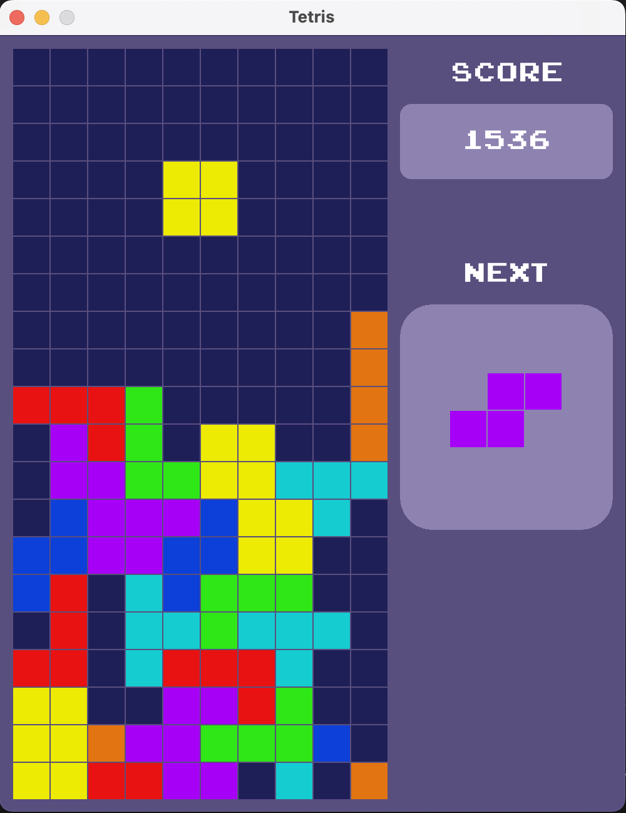
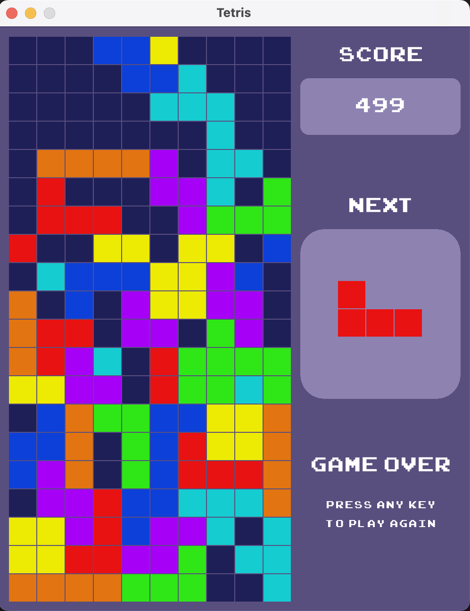

# Tetris Game

A classic Tetris implementation built with C++ and Raylib.

## Screenshots

<div align="center">
  
  &nbsp;&nbsp;&nbsp;&nbsp;
  
</div>

## Overview
Tetris is a classic tile-matching puzzle video game where players manipulate falling geometric shapes, called tetrominoes, to create complete horizontal lines within a rectangular playfield. Each tetromino is composed of four connected squares arranged in different configurations, and players must rotate and position them as they descend to prevent the stack from reaching the top. Successfully completing a line causes it to disappear, earning points and creating more room for new pieces.

## Features
- Classic Tetris gameplay with all 7 tetromino pieces (I, O, T, S, Z, J, L)
- Line clearing with scoring system
- Next piece preview
- Game over detection
- Sound effects and background music
- Smooth graphics with Raylib

## Prerequisites

### For Windows Users:
1. **Git** - Download from [https://git-scm.com/download/win](https://git-scm.com/download/win)
2. **Visual Studio** or **MinGW-w64** compiler
3. **Raylib** - We'll install this during setup

### For Mac Users:
1. **Xcode Command Line Tools** - Install by running `xcode-select --install` in Terminal
2. **Homebrew** - Install from [https://brew.sh](https://brew.sh)
3. **Git** (usually comes with Xcode tools)

## Installation Instructions

### Step 1: Clone the Repository

Open Terminal (Mac) or Command Prompt/Git Bash (Windows) and run:

```bash
git clone https://github.com/RJ-Tabelon/Tetris.git
cd Tetris
```

### Step 2: Install Dependencies

#### For Mac Users:

1. **Install Raylib using Homebrew:**
```bash
brew install raylib
```

2. **Install CMake (optional, for CMake build):**
```bash
brew install cmake
```

#### For Windows Users:

**Option A: Using vcpkg (Recommended)**
1. **Install vcpkg:**
```bash
git clone https://github.com/Microsoft/vcpkg.git
cd vcpkg
.\bootstrap-vcpkg.bat
.\vcpkg.exe install raylib:x64-windows
```

**Option B: Manual Installation**
1. Download Raylib from [https://www.raylib.com](https://www.raylib.com)
2. Extract to `C:\raylib`
3. Add `C:\raylib\lib` to your system PATH

### Step 3: Build and Run the Game

#### For Mac Users:

**Method 1: Direct Compilation (Easiest)**
```bash
clang++ -std=c++11 src/*.cpp -I/opt/homebrew/include -L/opt/homebrew/lib -lraylib -framework OpenGL -framework Cocoa -framework IOKit -framework CoreVideo -o tetris
./tetris
```

**Method 2: Using CMake**
```bash
mkdir build
cd build
cmake ..
make
./tetris
```

#### For Windows Users:

**Method 1: Using Visual Studio**
1. Open Visual Studio
2. Create a new C++ project
3. Add all `.cpp` files from the `src/` folder
4. Configure project to link with Raylib
5. Build and run

**Method 2: Using MinGW**
```bash
g++ -std=c++11 src/*.cpp -lraylib -lopengl32 -lgdi32 -lwinmm -o tetris.exe
tetris.exe
```

**Method 3: Using vcpkg**
```bash
g++ -std=c++11 src/*.cpp -I[vcpkg-root]/installed/x64-windows/include -L[vcpkg-root]/installed/x64-windows/lib -lraylib -o tetris.exe
tetris.exe
```

## Game Controls

- **←/→ Arrow Keys**: Move piece left/right
- **↓ Arrow Key**: Move piece down faster
- **↑ Arrow Key**: Rotate piece
- **Any Key**: Restart game when game over

## Project Structure

```
Tetris/
├── src/
│   ├── main.cpp          # Main game loop
│   ├── game.cpp/.h       # Game logic and state management
│   ├── grid.cpp/.h       # Game grid implementation
│   ├── block.cpp/.h      # Base block class
│   ├── blocks.cpp        # All tetromino implementations
│   ├── colors.cpp/.h     # Color definitions
│   └── position.cpp/.h   # Position utility class
├── Font/
│   └── ARCADECLASSIC.TTF # Game font
├── Sounds/
│   ├── music.mp3         # Background music
│   ├── clear.mp3         # Line clear sound
│   └── rotate.mp3        # Piece rotation sound
└── README.md
```

## Troubleshooting

### Common Issues:

1. **"raylib.h not found"**
   - Make sure Raylib is properly installed
   - Check include paths in compilation command

2. **Linking errors**
   - Ensure Raylib libraries are in the correct path
   - Verify all framework links are included (Mac)

3. **Audio not working**
   - Check that audio files exist in `Sounds/` folder
   - Ensure audio device permissions are granted

4. **Font not loading**
   - Verify `Font/ARCADECLASSIC.TTF` exists
   - Check file path is correct relative to executable

### Platform-Specific Issues:

**Mac:**
- If Homebrew installation fails, try: `brew update && brew install raylib`
- For Apple Silicon Macs, use `/opt/homebrew/` paths instead of `/usr/local/`

**Windows:**
- Ensure all DLL files are in the same directory as the executable
- Try running as Administrator if file access issues occur

## Contributing

1. Fork the repository
2. Create your feature branch (`git checkout -b feature/AmazingFeature`)
3. Commit your changes (`git commit -m 'Add some AmazingFeature'`)
4. Push to the branch (`git push origin feature/AmazingFeature`)
5. Open a Pull Request

## License

This project is open source and available under the [MIT License](LICENSE).
